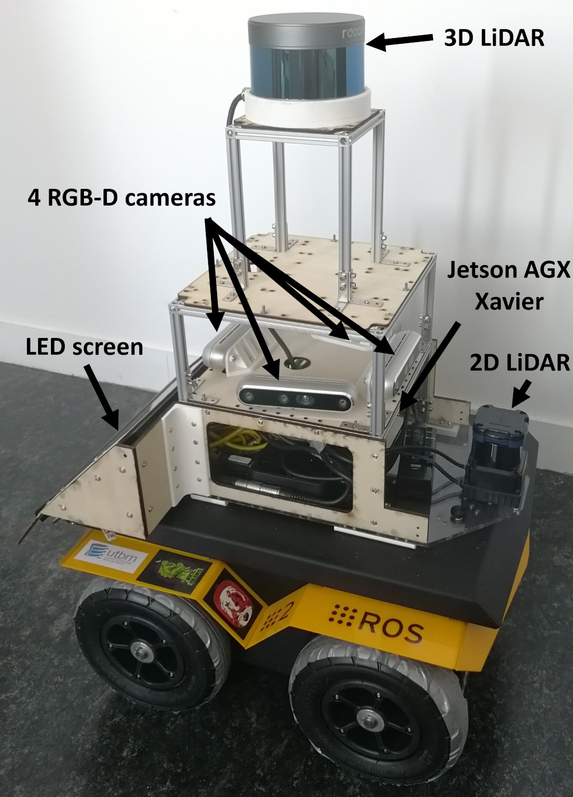
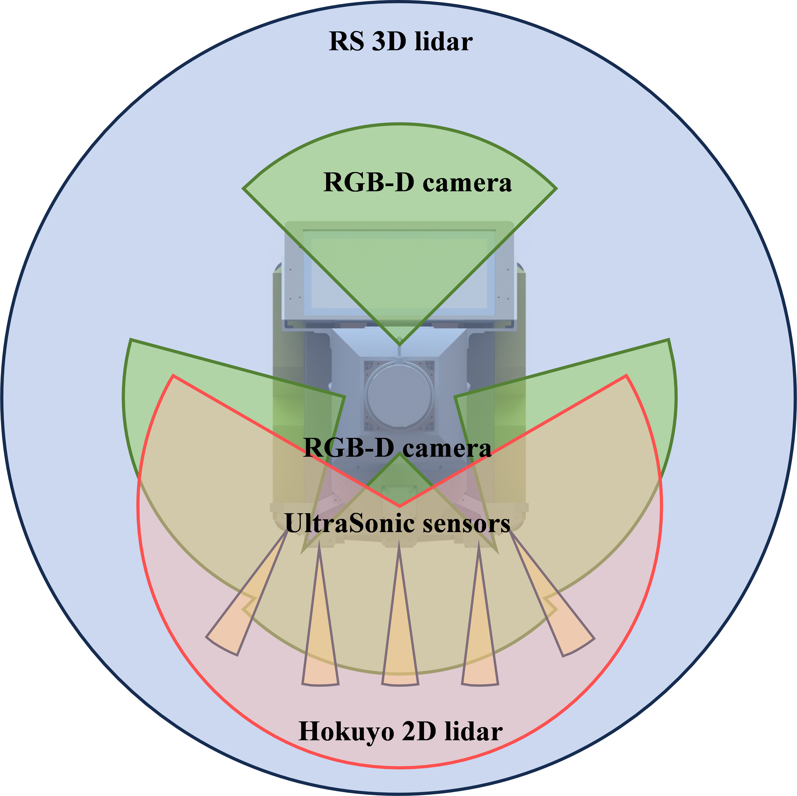
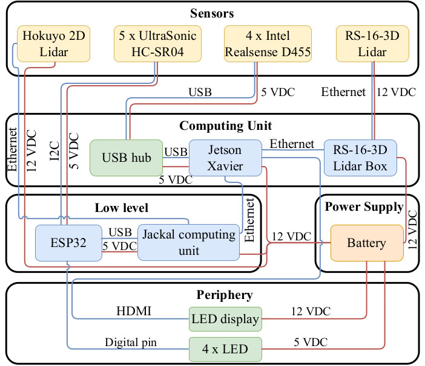
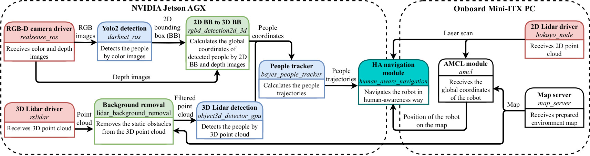

# A software-hardware integration scheme for human-aware robot navigation

*Please open an issue if you have any questions.*

```
@inproceedings{okunevich24arso,
title={An Open-source Software-hardware Integration Scheme for Embodied Human Perception in Service Robotics},
author={Iaroslav Okunevich and Vincent Hilaire and Stephane Galland and Olivier Lamotte and Yassine Ruichek and Zhi Yan},
booktitle={Proceedings of the 20th IEEE International Conference on Advanced Robotics and Its Social Impacts (ARSO)},
address = {Hong Kong, China},
month = {May},
year={2024},
organization={IEEE}
}
```

## The Prototype





## Hardware Architecture



To reproduce our perception tower, please check: [hardware](hardware) 

## Software Architecture



### Build
```sh
sudo apt install ros-melodic-navigation ros-melodic-people ros-melodic-navigation-layers
cd ~/catkin_ws/src/
git clone https://github.com/Nedzhaken/human_aware_navigation
cd ~/catkin_ws
catkin_make
```

### Run
```sh
// Just to see the effect:
roslaunch human_aware_navigation human_aware_navigation.launch
// Want to do benchmarking:
roslaunch human_aware_navigation experiment.launch
```

### Tested environment
```
Jetson Xavier AGX
Ubuntu 18.04
ROS Melodic
Jetpack 4.4.1
CUDA 10.2
PCL 1.8
Eigen 3
```

## Human-aware Navigation

As shown in the turquoise block in the software architecture diagram, a module for human-aware navigation can be deployed on any computing unit as needed. So far we've benchmarked :

1. [Social Navigation Layers](https://github.com/DLu/navigation_layers) (deployed on the onboard PC side, CPU-based)
2. [Time Dependent Planning](https://github.com/marinaKollmitz/human_aware_navigation) (deployed on the onboard PC side, CPU-based)
3. [Collision Avoidance with Deep Reinforcement Learning](https://github.com/mit-acl/cadrl_ros) (deployed on the AGX side, GPU-based)

We evaluated the social properties of the above methods from both the robot and human perspectives. For the latter we used the **Robotic Social Attributes Scale (RoSAS)** questionnaire: https://forms.gle/4Lr4KP1E81SJFAET9. Details on this part can be found in our paper:

```
@inproceedings{okunevich23ecmr,
title={Human-centered Benchmarking for Socially-compliant Robot Navigation},
author={Iaroslav Okunevich and Vincent Hilaire and Stephane Galland and Olivier Lamotte and Liubov Shilova and Yassine Ruichek and Zhi Yan},
booktitle={2023 European Conference on Mobile Robots (ECMR)},
pages = {1--7},
address = {Coimbra, Portugal},
month = {September},
year={2023},
organization={IEEE}
}
```
